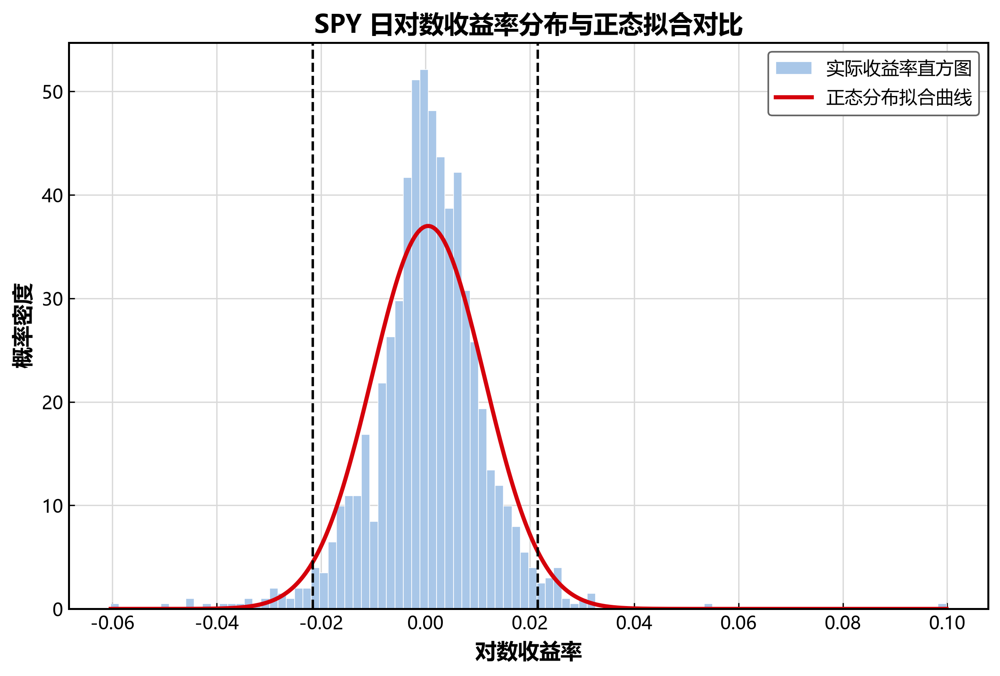
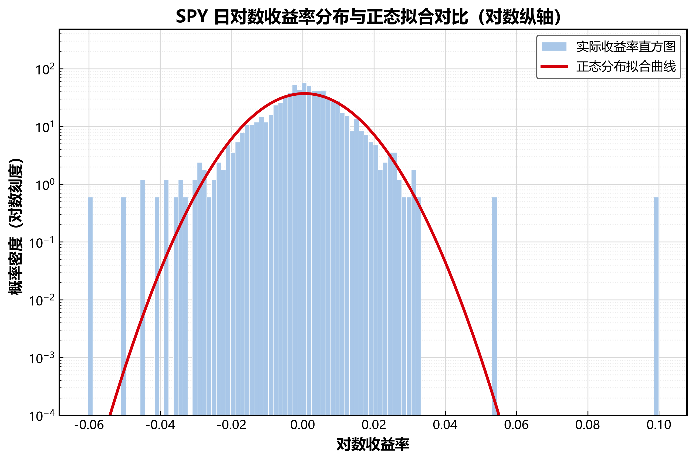
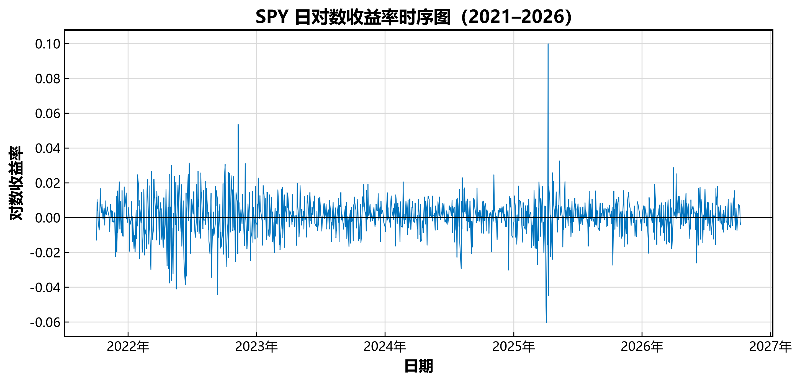
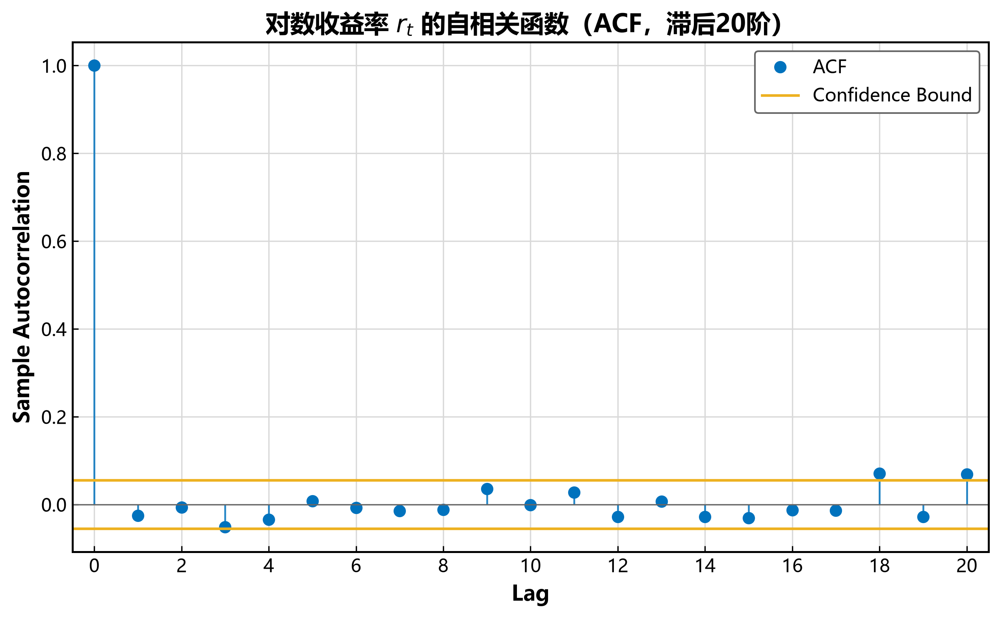
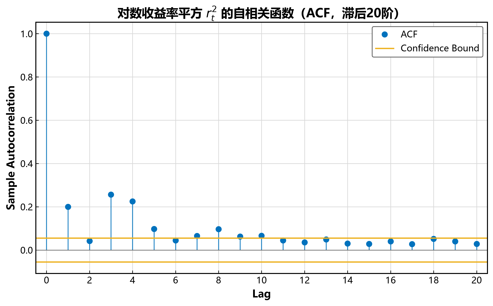
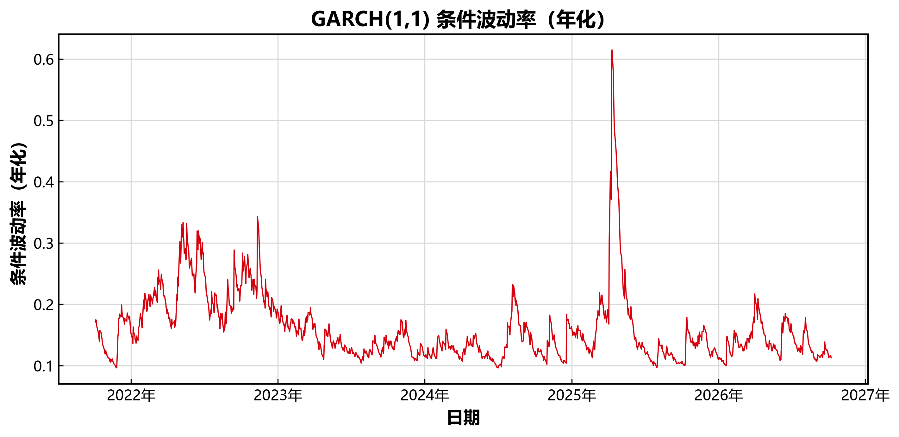

# SPY日度收益率时间序列的统计特征分析

> 这是一个从课程作业出发的独立延伸项目：金融时间序列课程报告原用 MATLAB 完成，见 course_report_matlab.pdf；此项目用Python将全部分析重新实现，两套代码数字能够互证。此外，还补充了原先课程报告未实现的 **GARCH(1,1) 手写极大似然估计**。开发过程中曾借助AI工具辅助调试与润色。

分析对象为标普500 ETF（SPY）2021-10 ~ 2026-10 共 **1258** 个日度对数收益率，数据下载自Yahoo Finance。

## 主要结论

1. **尖峰厚尾，正态性不成立**：对数收益率超额峰度 ≈ 7.97，Jarque-Bera 检验 p≈0；|z| > 4σ 的实际频率约为正态假设下的 75 倍
2. **日均收益率方向不可预测**：日均对数收益 0.051%（年化 ≈ 12.9%），但 t 检验 p≈0.09，不显著异于零；收益率 ACF 各阶基本落在 ±1.96/√n 置信界内，近似白噪声
3. **波动率集聚**：r² 的 Ljung-Box 检验在 5/10/20 阶均强烈拒绝无自相关（Q ≈ 211/241/260，p≈0）
4. **GARCH(1,1)**：α=0.10、β=0.86、α+β=0.97，波动持续性极高，冲击半衰期约 20 个交易日；条件波动率在2022年加息周期与2025年4月关税冲击期间显著放大

**总结**：日收益率在均值层面近似白噪声、线性不可预测，这是有效市场假说弱式有效的日频证据；但收益率并不独立，其二阶矩存在显著且持久的自相关，波动率可预测。该结论正是"因子挖掘难、风险管理必须用动态模型"的统计学根源。

## 与因子挖掘的关联

- 尖峰厚尾、波动聚集、收益率近白噪声是因子建模前必须确认的典型化事实，任何策略的显著性检验都要在这些数据特征下成立；
- 方向近不可预测，说明因子收益只是淹没在噪声中的微弱信号，需要严格的样本外检验与多重检验校正才能与运气区分；
- 波动显著可预测且持续性高（α+β≈0.97），表明低波动异象、波动率择时与组合风险控制都依赖GARCH族的动态波动建模，而非静态方差假设。

## 结果图表

| 分布 vs 正态拟合 | 尾部（对数轴） | 收益率时序 |
| --- | --- | --- |
|  |  |  |

| ACF(r) | ACF(r²) | GARCH 条件波动率 |
| --- | --- | --- |
|  |  |  |

## 快速复现

```bash
pip install -r requirements.txt
python main.py
```

终端打印描述性统计表、t 检验、Ljung-Box 检验表与 GARCH 参数估计；6 张图自动保存至 `figures/`。

## 文件结构

```text
├── main.py                  # 全部分析代码
├── requirements.txt         # 依赖：pandas / numpy / matplotlib / scipy / statsmodels
├── data.zip
│   └── SPY_2021_2026.csv    # Yahoo Finance 日度数据（调整后收盘价，1259 个交易日）
├── figures.zip              # 运行 main.py 后自动生成的 6 张图
└──course_report_matlab.pdf  # 原课程报告，matlab实现
```

## 实现要点

- **数据预处理**：日期升序、去重，同时构造简单收益率与对数收益率两种口径
- **统计检验**：Jarque-Bera 正态性检验、单样本 t 检验、ACF（±1.96/√n 置信界）、Ljung-Box Q 检验（5/10/20 阶）
- **GARCH(1,1)**：正态创新的极大似然估计，用 scipy.optimize（Nelder-Mead）手写实现，**不依赖 arch 库**；收益率 ×100 提高数值稳定性；参数约束 ω>0、α,β≥0、α+β<1；估计得 ω≈0.036，隐含无条件年化波动 ≈ 16.5%
- **年化约定**：252 个交易日

## 交叉验证
### GARCH手写实现与arch库的交叉验证

手写实现属于自写代码，为排除概念性错误，用工业标准库 arch（零均值、正态创新的相同模型设定）对同一数据重新估计，交叉验证结果：

| 参数 | 手写实现 | arch 库 | 差值 |
| --- | --- | --- | --- |
| ω | 0.0361 | 0.0349 | 0.0012 |
| α | 0.1021 | 0.0995 | 0.0025 |
| β | 0.8647 | 0.8683 | 0.0036 |
| α+β | 0.9667 | 0.9678 | 0.0011 |

两套实现参数差异均在千分位，来自两处细节：第一，优化器不同，我用了Nelder-Mead 配合罚函数，而 arch 库用了带约束的梯度法，路线不同导致寻优的落脚点有极小偏差；第二，σ₀²的初始化假设不同，我用的是样本方差预热，起始条件不同。
arch 库同时给出参数显著性：ω / α / β 的 t 值分别为 2.70 / 4.42 / 32.30，均在 1% 水平显著。手写实现参数与其几乎相同，显著性可相互参照。

### 与 MATLAB 版的交叉验证

两套独立实现的结果相互印证，核心统计量完全一致。细微差异来自两点：本版取数至 2026-10-08（样本多 3 个交易日），以及 Yahoo Finance 采用调整后收盘价。

## 背景与动机

中山大学金融学大三在读。这份代码是Python量化技术栈的自学练习：把计量经济学课上学到的假设检验与时间序列方法，用 Python 统计生态完整复现，并独立完成了原报告只提及未实现的GARCH建模。下一步计划：用同样的流程处理A股数据，复现经典因子的构造与检验，eg.动量、低波动。
